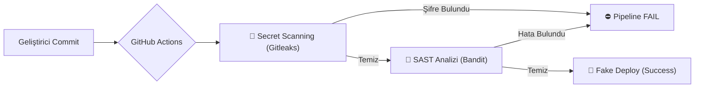

# 🛡️ End-to-End DevSecOps Pipeline

Bu proje, modern yazılım geliştirme süreçlerinde **güvenliği** en başa taşıyan (Shift-Left) kapsamlı bir **CI/CD (Sürekli Entegrasyon/Sürekli Dağıtım)** hattını simüle eder.

Amaç, güvensiz kodun (şifre ifşası veya hatalı konfigürasyon) canlı ortama geçmesini **otomasyon** ile engellemektir.

## 🚀 Proje Mimarisi

Bu pipeline, kod GitHub'a gönderildiği anda otomatik olarak tetiklenir ve aşağıdaki güvenlik kontrollerinden geçer:

Araç,Kategori,Kullanım Amacı
GitHub Actions,CI/CD,Otomasyon süreçlerini ve pipeline yönetimini sağlar.
Python (Flask),Uygulama,Güvenlik testlerinin yapıldığı örnek web uygulaması.
Gitleaks,Secret Scanning,Kod içinde unutulan API anahtarları ve şifreleri tarar.
Bandit,SAST,Python kodundaki güvenlik açıklarını (örn. 0.0.0.0 binding) tespit eder.

Bu projede gerçek bir DevSecOps döngüsü uygulanmıştır:

Hatalı Kod Gönderimi (Fail Senaryosu):

Uygulama içine bilerek DB_PASSWORD hardcoded olarak yazıldı.

Uygulama 0.0.0.0 (tüm ağlara açık) adresine bind edildi.

Sonuç: Pipeline, Gitleaks ve Bandit aşamalarında hata vererek dağıtımı durdurdu. 🛑

Güvenlik İyileştirmesi (Fix):

Şifreler os.environ.get ile ortam değişkenlerine taşındı.

Host adresi 127.0.0.1 (Localhost) olarak güncellendi.

Başarılı Dağıtım (Success Senaryosu):

Düzeltilen kod tekrar push edildi.

Sonuç: Tüm güvenlik taramaları başarıyla geçildi ve deploy işlemi gerçekleşti. ✅

📂 Proje Yapısı
Bash
.
├── .github/workflows/main.yml  # CI/CD Pipeline Konfigürasyonu
├── app.py                      # Flask Web Uygulaması (Güvenli Hale Getirilmiş)
├── requirements.txt            # Proje Bağımlılıkları
└── README.md                   # Proje Dokümantasyonu
